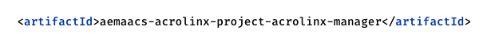

# Acrolinx-Installer-for-AEMaaCS

## Steps for Adding Acrolinx to AEMaaCS

Follow this step-by-step guide to integrate Acrolinx to your existing code repository.

## Adding the Acrolinx Module

- Create a clone of your Cloud Manager's Git repository.
- Copy the Acrolinx module from this repository to the root directory of the cloud manager code.
- Update  **/acrolinx/pom.xml**

  - Replace the parent pom section with your parent's pom details, as shown below:
    - Example shows adding to `aem-guides-wknd` sample project

  

  - Update the artifact Id as per your application's naming convention:

  

- Update  **/acrolinx/acrolinx.installer/pom.xml**

  - Update the artifact id as per your application's naming conventions.

  

- Add the Acrolinx module in the parent pom module section.

  

- Add a dependency to `all` module for acrolinx installer

  In the `all` module's pom.xml add:

  ```xml
  <dependency>
    <groupId>com.acrolinx.client</groupId>
    <artifactId>aemaacs-acrolinx-project-acrolinx-installer</artifactId>
    <version>0.0.1-SNAPSHOT</version>
    <type>zip</type>
  </dependency>
  ```

  In the plugin section of the `all` module under the `filevault-package-maven-plugin` add a `embedded` section similar to other modules.

  ```xml
  <embeddeds>
    <embedded>
      <groupId>com.acrolinx.client</groupId>
      <artifactId>aemaacs-acrolinx-project-acrolinx-installer</artifactId>
      <type>zip</type>
      <target>/apps/wknd-packages/application/install</target> <!-- Adjust path as per your project-->
    </embedded>
  </embeddeds>
  ```

## Configure Acrolinx URL and Generic Token

In cloud manager configuration add the following environment variables.

| NAME | VALUE | TYPE | DEFAULT | OPTIONAL |
|------|-------|------|---------|----------|
|`ACROLINX_URL`| `https://<tenant>.acrolinx.cloud`| variable || No |
|`ACROLINX_GENERIC_TOKEN`|`secret-token`|secret|| No |
|`ACROLINX_FORWARD_COOKIES`|`true` or `false`| variable |`false`| Yes |
|`ACROLINX_LOG_LEVEL`|`DEBUG`| variable |`INFO`| Yes |

Example:


## [Optional] Configure Acrolinx Access

Refer the "Configure Acrolinx Access" section in the [documentation](https://docs.acrolinx.com/aem/latest/en/acrolinx-for-adobe-experience-manager-admin-guide) before updating the value.

| NAME | VALUE | TYPE | DEFAULT | OPTIONAL |
|------|-------|------|---------|----------|
|`ACROLINX_ALLOWED_REGEX`|`your-site-name`| variable | `.*` | Yes |

## Updating Acrolinx

Update `acrolinx.version` property in **/acrolinx/acrolinx.installer/pom.xml**

Example: `<acrolinx.version>2.0.0</acrolinx.version>`

## Uninstalling Acrolinx

- Remove the Acrolinx module from your cloud project.
- Remove entries from parent pom.xml in your project.
- Remove cloud configuration for Acrolinx URL, generic token.
- Rerun cloud manager pipeline.

## License

Copyright 2022-present Acrolinx GmbH

Licensed under the Apache License, Version 2.0 (the "License");
you may not use this file except in compliance with the License.
You may obtain a copy of the License at:

[http://www.apache.org/licenses/LICENSE-2.0](http://www.apache.org/licenses/LICENSE-2.0)

Unless required by applicable law or agreed to in writing, software
distributed under the License is distributed on an "AS IS" BASIS,
WITHOUT WARRANTIES OR CONDITIONS OF ANY KIND, either express or implied.
See the License for the specific language governing permissions and
limitations under the License.

For more information visit: [https://www.acrolinx.com](https://www.acrolinx.com)
